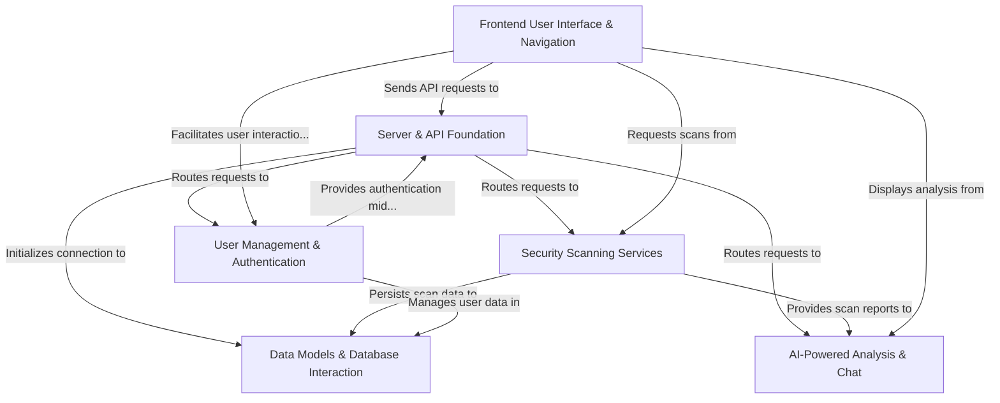
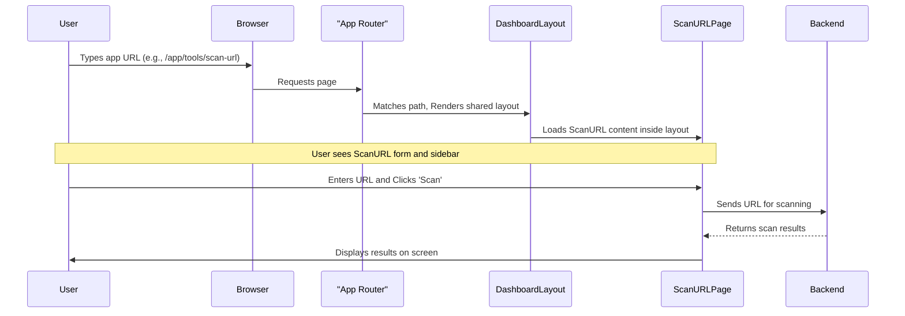
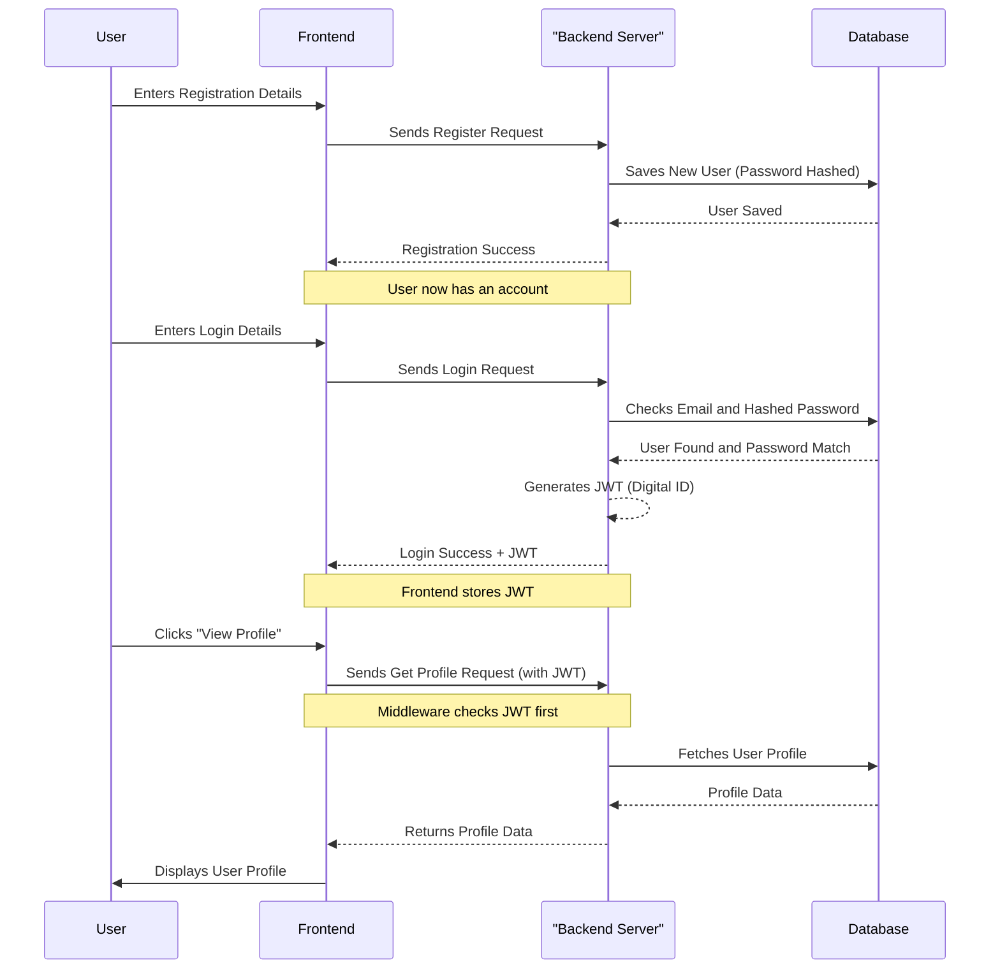
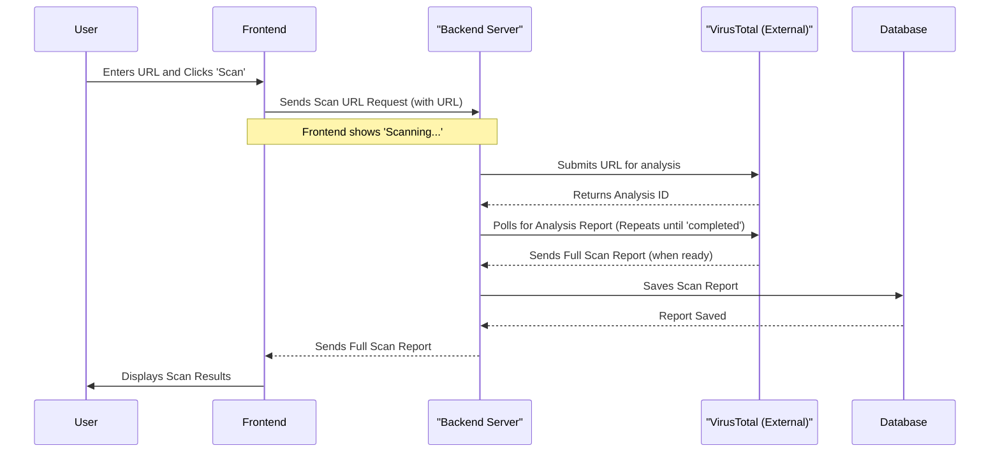
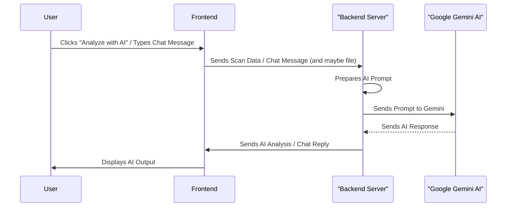
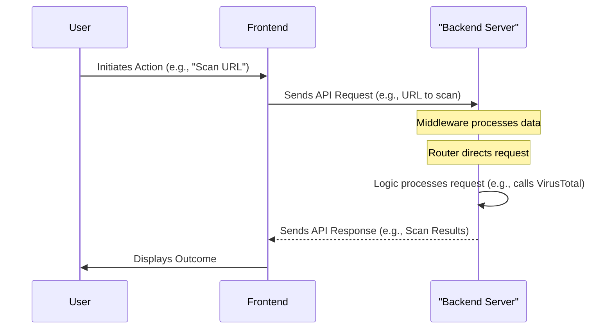
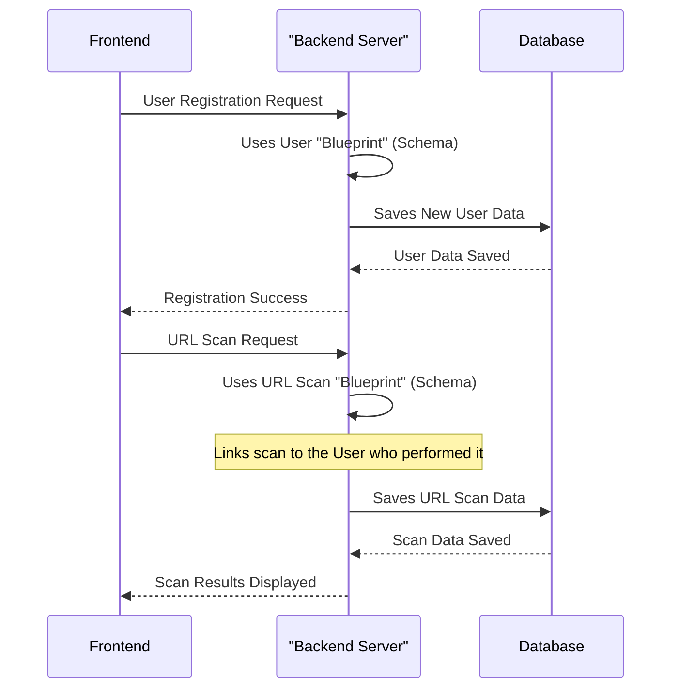

# Tutorial: GGCyberSecure

The `GGCyberSecure` is a **comprehensive cybersecurity platform** designed to help users protect their digital presence. It offers various _security scanning services_ for URLs, IP addresses, domains, and files to detect potential threats. Leveraging **AI-powered analysis**, it provides in-depth reports and a conversational chatbot for cybersecurity guidance. The platform also includes **secure user management** features for registration, login, and profile management, all accessible through an _intuitive frontend user interface_.

## Visual Overview



## Chapters

1. [Frontend User Interface & Navigation
   ](01_frontend_user_interface___navigation_.md)
2. [User Management & Authentication
   ](02_user_management___authentication_.md)
3. [Security Scanning Services
   ](03_security_scanning_services_.md)
4. [AI-Powered Analysis & Chat
   ](04_ai_powered_analysis___chat_.md)
5. [Server & API Foundation
   ](05_server___api_foundation_.md)
6. [Data Models & Database Interaction
   ](06_data_models___database_interaction_.md)


# Chapter 1: Frontend User Interface & Navigation

Welcome to the `GGCyberSecure` tutorial! In this first chapter, we're going to explore the very first thing you see and interact with when you use any application: its **Frontend User Interface (UI)** and how you **Navigate** through it. Think of it like walking into a new building – the frontend is the lobby, the rooms, the signs, and the hallways that guide you.

### What is the Frontend? Your Digital Dashboard!

The "frontend" is simply everything you can _see_ and _click_ on in our security application. It's the visual part, like a car's dashboard and steering wheel. It's designed to be your command center for managing security tasks.

Why is this so important? Imagine if you had to type complex commands into a black screen every time you wanted to check if a website was safe. That would be really hard! Our frontend solves this by taking complicated security checks and presenting them to you in an easy-to-understand way, using buttons, forms, and clear displays. It makes powerful security tools accessible to everyone.

#### Our Main Goal: Using a Security Tool

Let's imagine a core task you might want to do: **scanning a suspicious website link (URL)** to see if it's safe. In this chapter, we'll see how the frontend helps you achieve this, from opening the app to seeing the results.

### Key Concepts of the Frontend

The frontend is built from a few simple ideas:

1.  **User Interface (UI)**: This is literally "what you see." It includes all the buttons, text boxes, images, and messages on your screen. Good UI makes an app easy and pleasant to use.
2.  **Navigation**: This is "how you move around" the app. It's the menu, the links, and anything that helps you jump from one section (like "Dashboard") to another (like "Security Tools").
3.  **Components**: Think of these as reusable LEGO bricks. Instead of building every button from scratch, we create a "Button Component" once and use it everywhere. This makes building the app faster and keeps it looking consistent.
4.  **Pages**: These are like individual screens or views in the app. For example, we have a "Login" page, a "Dashboard" page, and a "Scan URL" page. Each page focuses on a specific task or information.
5.  **Routing**: This is the system that decides which "page" to show based on the address (URL) you type or the link you click. When you click "Scan URL," the router ensures the correct page loads.
6.  **Layout**: This defines the overall structure of the app. For example, our app often has a "sidebar menu" that stays on the left side, and the main content changes on the right. This consistent layout helps you always know where you are.

### How You Use the App: A Step-by-Step Example

Let's walk through how you, as a user, would scan a URL using the `GGCyberSecure` application:

1.  **Visit the Homepage**: You open your web browser and go to the application's address. You see an inviting homepage.
2.  **Log In (or Register)**: To access the security tools, you'll need to sign in. You click a "Login" button, type your email and password, and press "Sign In."
3.  **See the Dashboard**: After logging in, you're taken to your personal "Dashboard." This is your central hub, showing an overview of your security activities.
4.  **Use the Sidebar Navigation**: On the left side of the screen, you'll notice a **sidebar menu**. This is your main way to navigate. You look for "Security Tools" and click on it.
5.  **Select a Tool**: The "Security Tools" page appears, showing different options like "Scan URL," "Domain Check," and "IP Address Scan." You click on "Scan URL."
6.  **Enter Your URL**: Now you're on the "Scan URL" page. You see a text box where you can type or paste the suspicious website link. You input `https://malicious-example.com`.
7.  **Initiate Scan**: You click the "Scan URL" button right next to the text box. The app shows a loading indicator.
8.  **View Results**: After a short wait, the scan results appear right there on the page, telling you if `https://malicious-example.com` is safe or dangerous!

This entire process, from clicking buttons to seeing new screens, is powered by our Frontend User Interface and Navigation system.

### Under the Hood: How the Frontend Works (Simplified)

Let's peek behind the curtain to understand how the app handles your journey from logging in to scanning a URL.

#### The Journey: A High-Level View

When you interact with the app, here's a simplified sequence of what happens:



The key idea here is that the "App Router" acts like a central traffic controller. It directs requests to the right "page" and makes sure shared parts, like the sidebar, are always there when needed.

#### Diving into the Code: Routing

The `App.jsx` file is where our main "traffic controller" (the router) is set up. It defines all the different web addresses (paths) and which "pages" should be shown for each.

Let's look at a simplified version of `App.jsx`:

```jsx
// frontend/src/App.jsx (simplified)
import { Routes, Route } from "react-router-dom";
import Home from "./pages/Home";
import Login from "./pages/Login";
import DashboardLayout from "./layout/DashboardLayout"; // Our main layout
import ScanURL from "./pages/ScanURL"; // A specific tool page
import PrivateRoute from "./components/PrivateRoute"; // For protected pages

function App() {
  return (
    <Routes>
      <Route path="/" element={<Home />} /> {/* Homepage */}
      <Route path="/login" element={<Login />} /> {/* Login page */}
      {/* Protected routes that require login */}
      <Route
        path="/app"
        element={
          <PrivateRoute>
            {" "}
            {/* Ensures user is logged in */}
            <DashboardLayout /> {/* This is our main layout */}
          </PrivateRoute>
        }
      >
        {/* Pages that appear *inside* the DashboardLayout */}
        <Route path="profile" element={<Profile />} />
        <Route path="dashboard" element={<Dashboard />} />
        <Route path="tools" element={<Tools />} />
      </Route>
      {/* Specific tool pages (also protected) */}
      <Route
        path="/app/tools/scan-url"
        element={
          <PrivateRoute>
            <ScanURL /> {/* This page also gets DashboardLayout indirectly */}
          </PrivateRoute>
        }
      />
      {/* ... other tool routes like /app/tools/domain-check, /app/tools/ip-scan */}
    </Routes>
  );
}

export default App;
```

- **`Routes`**: This is like a big map for our application.
- **`Route`**: Each `Route` is a specific entry on the map. It says: "If the web address (`path`) looks like this, then show this `element` (which is a page or a layout)."
- **`DashboardLayout`**: Notice how `/app` uses `DashboardLayout`. This means any page starting with `/app` (like `/app/profile` or `/app/dashboard`) will automatically have the `DashboardLayout` around it, providing the consistent sidebar and header.
- **`PrivateRoute`**: This is a special helper that acts like a bouncer. Before showing a protected page, it checks if you're logged in. If not, it sends you to the Login page.

Here's how `PrivateRoute` is very simple:

```jsx
// frontend/src/components/PrivateRoute.jsx (simplified)
import { Navigate } from "react-router-dom";

const PrivateRoute = ({ children }) => {
  const token = localStorage.getItem("token"); // Check if a login token exists
  return token ? children : <Navigate to="/login" />; // If no token, go to login
};

export default PrivateRoute;
```

- If you have a `token` (meaning you're logged in), it shows the `children` (which is the actual page, like `ScanURL`).
- If no `token`, it automatically redirects you to `/login`.

#### The Consistent Look: Dashboard Layout

The `DashboardLayout.jsx` file is responsible for giving most of our application's pages a consistent look and feel. It sets up the main structure: the sidebar on the left and a main area for content on the right.

```jsx
// frontend/src/layout/DashboardLayout.jsx (simplified)
import Sidebar from "../components/Sidebar"; // Our navigation menu
import { Outlet } from "react-router-dom"; // Placeholder for specific page content

const DashboardLayout = () => {
  return (
    <div className="min-h-screen flex bg-[#0B1120] text-white">
      <Sidebar /> {/* This is our fixed sidebar menu */}
      <main className="flex-1 p-6 mt-4 md:ml-60">
        <Outlet />{" "}
        {/* This is where the actual page content (e.g., ScanURL) will appear */}
      </main>
    </div>
  );
};

export default DashboardLayout;
```

- **`Sidebar`**: This is our main navigation menu, always visible.
- **`Outlet`**: This is a special placeholder from `react-router-dom`. Whatever `Route` is nested inside `DashboardLayout` in `App.jsx` will be displayed here. So, if you're on `/app/profile`, the `Profile` page content will show up where `Outlet` is.

#### Moving Around: The Sidebar

The `Sidebar.jsx` component is crucial for navigation. It contains all the links you see on the left-hand menu.

```jsx
// frontend/src/components/Sidebar.jsx (simplified)
import { Link, useLocation } from "react-router-dom"; // For navigation links
import { motion } from "framer-motion"; // For smooth animations

const Sidebar = () => {
  const location = useLocation(); // Helps us know which link is currently active

  const navItems = [
    { label: "Profile", path: "/app/profile", icon: "👤" },
    { label: "Dashboard", path: "/app/dashboard", icon: "📊" },
    { label: "Security Tools", path: "/app/tools", icon: "🛡️" },
    // ... other navigation items
  ];

  return (
    <div className="fixed top-0 left-0 h-screen ...">
      {/* ... user profile section ... */}

      <nav className="flex flex-col gap-2">
        {navItems.map((item) => (
          <Link
            key={item.path}
            to={item.path} // This is where the link directs
            className={`flex items-center gap-3 p-3 rounded-lg ... ${
              location.pathname === item.path
                ? "bg-gradient-to-r ..."
                : "hover:bg-gray-700" // Highlight active link
            }`}
          >
            <motion.span>{item.icon}</motion.span> {/* Display icon */}
            <span className="font-medium">{item.label}</span> {/* Display label */}
          </Link>
        ))}
        {/* ... logout button ... */}
      </nav>
    </div>
  );
};

export default Sidebar;
```

- **`navItems`**: This is a list of all the menu items, each with a `label`, a `path` (the web address it goes to), and an `icon`.
- **`Link`**: This component from `react-router-dom` creates a clickable link. When you click it, the router updates the URL and shows the correct page without reloading the entire application.
- **`useLocation`**: This "hook" tells the `Sidebar` which page is currently active, so it can highlight the corresponding menu item.

#### The "Scan URL" Page

Finally, the `ScanURL.jsx` file is a specific example of a "page" component. It contains the form where you enter the URL and displays the results.

```jsx
// frontend/src/pages/ScanURL.jsx (simplified for UI/Navigation focus)
import React, { useState } from "react";
import { motion } from "framer-motion"; // For animations
import { Link as LinkIcon, Shield, Loader2 } from "lucide-react"; // Icons

const ScanURL = () => {
  const [url, setUrl] = useState(""); // Stores what you type in the box
  const [loading, setLoading] = useState(false); // Controls loading indicator
  const [scanData, setScanData] = useState(null); // Stores scan results

  const handleSubmit = async (e) => {
    e.preventDefault();
    if (!url) return;
    setLoading(true);
    setScanData(null);

    // --- IMPORTANT: The actual logic for sending URL to backend and getting results
    // --- is handled in a later chapter ([Chapter 3: Security Scanning Services](03_security_scanning_services_.md))
    // --- For now, just imagine it does its job and sets scanData and setLoading(false)
    console.log("Simulating scan for:", url); // This would be replaced by real API call
    setTimeout(() => {
      setScanData({
        url: url,
        scanResult: {
          attributes: {
            stats: {
              malicious: 5,
              suspicious: 10,
              harmless: 80,
              undetected: 5,
            },
          },
        },
      });
      setLoading(false);
    }, 2000); // Simulate network delay
  };

  return (
    <motion.div className="min-h-screen bg-gradient-to-br ... p-4">
      <h1 className="text-4xl font-bold ... mb-2">URL Security Scanner</h1>
      <p className="text-gray-400">
        Analyze any URL for potential security threats
      </p>

      <form
        onSubmit={handleSubmit}
        className="flex flex-col gap-4 max-w-2xl mb-12"
      >
        <div className="relative">
          <LinkIcon className="absolute inset-y-0 left-0 flex items-center pl-3 text-cyan-400 w-5 h-5" />
          <input
            type="url"
            required
            placeholder="https://example.com"
            value={url}
            onChange={(e) => setUrl(e.target.value)} // Updates the URL state
            className="w-full p-4 pl-10 rounded-lg bg-gray-800 border ..."
          />
        </div>
        <motion.button
          type="submit"
          disabled={loading}
          className="flex items-center justify-center gap-2 bg-gradient-to-r ..."
        >
          {loading ? (
            <>
              <Loader2 className="w-5 h-5 animate-spin" /> Scanning...
            </>
          ) : (
            <>
              <Shield className="w-5 h-5" /> Scan URL
            </>
          )}
        </motion.button>
      </form>

      {scanData && ( // Only show if we have scan data
        <motion.div
          initial={{ opacity: 0, y: 20 }}
          animate={{ opacity: 1, y: 0 }}
          className="bg-gray-800/50 ... p-6 rounded-xl"
        >
          <h3 className="text-xl font-semibold ... mb-6">Scan Summary</h3>
          <p className="text-gray-400 mb-1">Scanned URL:</p>
          <p className="text-cyan-400 font-mono break-all">{scanData.url}</p>
          {/* ... Display of scan results using scanData ... */}
        </motion.div>
      )}
    </motion.div>
  );
};

export default ScanURL;
```

- **`useState`**: This "hook" helps us manage small pieces of information that can change, like what the user typed (`url`) or if the app is busy (`loading`).
- **`handleSubmit`**: When you click "Scan URL," this function runs. It takes the URL you typed and, in a real scenario, would send it to our backend for the actual scanning. (For simplicity, we've simulated this part here, as the real scanning logic is in [Chapter 3: Security Scanning Services](03_security_scanning_services_.md)).
- **Conditional Rendering**: Notice `scanData && (...)`. This means the scan results section will _only_ appear on the screen once `scanData` has information (i.e., after the scan is complete).

### Conclusion

In this chapter, you've learned that the frontend is the user-friendly face of our `GGCyberSecure` application. It's built using various "components" that form "pages," all organized by a "layout" and connected through "routing." This system allows you to easily navigate, interact with forms, and view complex security data in a simple way.

Next, we'll dive into how the app knows who you are and keeps your information safe, by exploring [Chapter 2: User Management & Authentication](02_user_management___authentication_.md).

# Chapter 2: User Management & Authentication

Welcome back to the `GGCyberSecure` tutorial! In [Chapter 1: Frontend User Interface & Navigation](01_frontend_user_interface___navigation_.md), we learned about the visual part of our application – how you see and interact with it. But what happens _after_ you click "Login" or "Register"? How does the app know who you are, keep your data safe, and remember your preferences?

This is where **User Management & Authentication** comes in. Think of it like the security checkpoint and personal locker system for our application. It's crucial because we don't want just anyone accessing sensitive security tools or your personal scan history. This component ensures that only _you_ can access _your_ account and the features connected to it.

### What is User Management & Authentication?

At its heart, this part of the system is about identifying you and managing your digital identity within the `GGCyberSecure` app.

**The main problem it solves:** How does an application know it's _really you_ trying to log in, and how does it protect your information and actions from others?

**Our Core Use Case:** Let's imagine you want to use the `GGCyberSecure` application to scan a suspicious URL, but you're a new user. The first step would be to **register for an account**, and then **log in** to access the scanning features. Later, you might want to **update your profile information** or **recover your password** if you forget it.

This chapter will guide you through how our application handles these essential steps.

### Key Concepts

User Management & Authentication is built on a few core ideas:

1.  **User Accounts:** This is simply your digital identity in the system. It usually includes your email, a password, and other personal details.
2.  **Registration:** The process of creating a brand new user account. This is where you pick your username (or email) and set a password.
3.  **Login:** The process of proving to the application that you are who you claim to be. You typically provide your email/username and password.
4.  **Password Hashing:** A super important security technique. Instead of storing your actual password, we scramble it into a long, unreadable code (a "hash"). If someone ever got hold of our database, they wouldn't see your real password, just the scrambled version.
5.  **JWT (JSON Web Token):** Pronounced "jot," this is like your temporary "digital ID card" or "session pass." Once you log in, the server gives you a JWT. For a certain period, you'll show this "pass" with every request to prove you're logged in, instead of typing your password every time.
6.  **User Profiles:** After logging in, you can often view and update your personal details (like your name, email, or phone number).
7.  **Password Recovery:** If you forget your password, this feature allows you to reset it safely, usually by sending a special link to your registered email.
8.  **Authentication Middleware:** This acts like a vigilant "security guard." Before you can access protected areas of the app (like your dashboard or the scanning tools), this middleware checks your JWT (your "ID card"). If your ID is valid, it lets you in; otherwise, it denies access and asks you to log in.

### How it Works: A User's Journey (High-Level)

Let's trace your path from being a new user to successfully scanning a URL, focusing on the backend (server) interactions.



This diagram shows the main flow: you interact with the Frontend, which then talks to the Backend. The Backend, in turn, interacts with the Database to store or retrieve user information. The JWT is your key to accessing protected parts of the application after logging in.

### Diving into the Code: The Backend's Role

Now, let's look at how this security checkpoint and locker system are built using code on the backend (server side). The backend is responsible for processing requests like "register," "login," and "get my profile."

#### 1. Registration: Creating Your Account

When you fill out the registration form on the frontend and click "Sign Up," the frontend sends your details to our backend.

**`backend/src/controller/userController.js` (Simplified `registerUser`)**

```javascript
// ... (imports)

const registerUser = async (req, res) => {
  try {
    // 1. Calls a service to handle the core logic
    const user = await registerUserService(req.body);
    // 2. A token (JWT) would normally be generated here too, but for simplicity
    //    we'll focus on it in the login step.
    res
      .status(201)
      .json({ success: true, message: "User registered successfully" });
  } catch (error) {
    res.status(400).json({
      success: false,
      message: "Registration failed",
      error: error.message,
    });
  }
};

// ... (other controller functions)
```

- `registerUser`: This function receives the user's data (like email and password) from the frontend.
- `registerUserService`: It then passes this data to a special "service" function. Services are like dedicated workers that handle the main business logic (e.g., creating a user in the database).

**`backend/src/service/userService.js` (Simplified `registerUserService`)**

```javascript
// ... (imports)

const registerUserService = async (userData) => {
  // This line creates a new user in our database
  // The User model (schema) automatically hashes the password before saving!
  const user = await User.create(userData);
  return user;
};

// ... (other service functions)
```

- `User.create(userData)`: This is the magic line! It takes the user's details and saves them into our database. Importantly, our `User` model (which defines how user data looks in the database, covered in [Chapter 6: Data Models & Database Interaction](06_data_models___database_interaction_.md)) is set up to _automatically scramble (hash)_ the password before it's stored. This keeps your password safe.

#### 2. Login: Proving Who You Are

After registering, you'll want to log in. You provide your email and password.

**`backend/src/controller/userController.js` (Simplified `loginUser`)**

```javascript
// ... (imports)

const loginUser = async (req, res) => {
  try {
    const { email, password } = req.body;
    // 1. Calls a service to verify credentials
    const user = await loginUserService(email, password);

    if (!user) {
      // If user not found or password doesn't match
      return res
        .status(401)
        .json({ success: false, message: "Invalid credentials" });
    }

    // 2. If successful, generate a JWT (your digital ID card)
    const token = user.generateJWT();
    res
      .status(200)
      .json({ success: true, message: "Login successful", token, user });
  } catch (error) {
    res
      .status(400)
      .json({ success: false, message: "Login failed", error: error.message });
  }
};

// ... (other controller functions)
```

- `loginUserService(email, password)`: This sends your email and password to the service for verification.
- `user.generateJWT()`: If your login is successful, the server creates your "digital ID card" (the JWT) and sends it back to the frontend. The frontend then stores this token (e.g., in your browser's local storage) so it can send it with future requests.

**`backend/src/service/userService.js` (Simplified `loginUserService`)**

```javascript
// ... (imports)

const loginUserService = async (email, password) => {
  // 1. Find the user by email
  const user = await User.findOne({ email }).select("+password"); // Need password to compare
  if (!user) return null; // No user with that email

  // 2. Compare the provided password with the stored hashed password
  const isMatch = await user.comparePassword(password);
  if (!isMatch) return null; // Passwords don't match

  return user; // Login successful!
};

// ... (other service functions)
```

- `User.findOne({ email }).select("+password")`: This finds the user in the database by their email. We also tell it to include the stored hashed password for comparison.
- `user.comparePassword(password)`: This is a special method that takes the password you typed and compares it to the _hashed_ password stored in the database. It does this securely without ever revealing the actual password.

#### 3. The Security Guard: Authentication Middleware

Once you have a JWT, how does the app use it to protect sensitive parts? That's the job of the authentication middleware.

**`backend/src/middleware/protectUser.js` (Simplified `protectUser`)**

```javascript
import jwt from "jsonwebtoken";
import User from "../schema/userSchema.js";

export const protectUser = async (req, res, next) => {
  let token;

  // 1. Check if the request has an Authorization header with a "Bearer" token
  if (
    req.headers.authorization &&
    req.headers.authorization.startsWith("Bearer")
  ) {
    try {
      token = req.headers.authorization.split(" ")[1]; // Get the token part
      // 2. Verify the token using our secret key
      const decoded = jwt.verify(token, process.env.JWT_SECRET);
      // 3. Find the user in the database using the ID from the token
      req.user = await User.findById(decoded.id).select("-password"); // Attach user to request
      next(); // Let the request continue to the actual function (e.g., get profile)
    } catch (error) {
      return res
        .status(401)
        .json({ success: false, message: "Unauthorized access" });
    }
  }

  if (!token) {
    // If no token was found
    return res.status(401).json({ success: false, message: "Token not found" });
  }
};
```

- `protectUser`: This function runs _before_ any protected route (like getting your profile).
- It checks the `Authorization` header in your request for the JWT.
- `jwt.verify`: This function checks if the JWT is valid and hasn't been tampered with. It uses a secret key that only our server knows.
- If the token is valid, it decodes it to find your `user.id`.
- `User.findById(decoded.id)`: It then finds your full user details from the database and attaches them to the `req.user` object. This way, the next function (e.g., `getUserProfile`) knows exactly which user is making the request.
- `next()`: If all checks pass, `next()` is called, allowing the request to proceed to its intended destination (like fetching the user's profile). If not, it sends a `401 Unauthorized` error.

#### 4. Accessing Protected Information: Your Profile

Now that our security guard (`protectUser` middleware) is in place, we can define routes that _require_ a logged-in user.

**`backend/src/routes/userRoutes.js` (Showing Protected Routes)**

```javascript
import express from "express";
import {
  registerUser,
  loginUser,
  getUserProfile,
  updateUserProfile,
  forgotPassword,
  resetPassword,
} from "../controller/userController.js";
import { protectUser } from "../middleware/protectUser.js"; // Our security guard

const router = express.Router();

router.post("/auth/register", registerUser); // Public route
router.post("/auth/login", loginUser); // Public route
router.get("/profile", protectUser, getUserProfile); // Protected!
router.put("/update-profile", protectUser, updateUserProfile); // Protected!
router.post("/forgot-password", forgotPassword); // Public route
router.post("/reset-password/:token", resetPassword); // Public route

export default router;
```

- `router.get("/profile", protectUser, getUserProfile)`: This line is key. When a request comes to `/profile`, `protectUser` runs _first_. Only if `protectUser` successfully verifies the user's JWT will `getUserProfile` be called.

**`backend/src/controller/userController.js` (Simplified `getUserProfile`)**

```javascript
// ... (imports)

const getUserProfile = async (req, res) => {
  try {
    // req.user is available because protectUser middleware set it!
    const user = await getUserByIdService(req.user.id);
    res.status(200).json({
      success: true,
      message: "User profile retrieved successfully",
      user,
    });
  } catch (error) {
    res.status(400).json({
      success: false,
      message: "Failed to retrieve user profile",
      error: error.message,
    });
  }
};

// ... (other controller functions)
```

- `req.user.id`: Thanks to the `protectUser` middleware, the `getUserProfile` function already knows _which_ user is requesting their profile, without them having to send their ID again! It's securely attached to the `req` (request) object.

#### 5. Updating Your Profile

Similarly, updating your profile also requires you to be logged in.

**`backend/src/controller/userController.js` (Simplified `updateUserProfile`)**

```javascript
// ... (imports)

const updateUserProfile = async (req, res) => {
  try {
    // Again, req.user.id tells us who is updating their profile
    const user = await updateUserProfileService(req.user.id, req.body);
    res.status(200).json({
      success: true,
      message: "User profile updated successfully",
      user,
    });
  } catch (error) {
    res.status(400).json({
      success: false,
      message: "Failed to update user profile",
      error: error.message,
    });
  }
};

// ... (other controller functions)
```

- `updateUserProfileService`: This passes your ID and the new data to the service.

**`backend/src/service/userService.js` (Simplified `updateUserProfileService`)**

```javascript
// ... (imports)

const updateUserProfileService = async (userId, updateData) => {
  // It's important to check for duplicate emails/phones before updating
  // (Simplified for brevity, but full code includes these checks)

  // Find user by ID and update their data
  const user = await User.findByIdAndUpdate(userId, updateData, {
    new: true, // Return the updated document
    runValidators: true, // Ensure data follows schema rules
  }).select("-password"); // Don't return the password

  return user;
};

// ... (other service functions)
```

- `User.findByIdAndUpdate`: This finds your user record by ID and applies the changes provided in `updateData`. It ensures the new data is valid before saving.

#### 6. Password Recovery: When You Forget

What if you forget your password? The `GGCyberSecure` has a safe way to reset it.

**`backend/src/controller/userController.js` (Simplified `forgotPassword` and `resetPassword`)**

```javascript
// ... (imports, including crypto and nodemailer)

const forgotPassword = async (req, res) => {
  const { email } = req.body;
  try {
    const user = await User.findOne({ email });
    if (!user) return res.status(404).json({ message: "User not found" });

    // 1. Generate a unique, temporary token for password reset
    const token = crypto.randomBytes(32).toString("hex");
    user.resetPasswordToken = token;
    user.resetPasswordExpires = Date.now() + 3600000; // Token valid for 1 hour
    await user.save();

    // 2. Set up email sender (Nodemailer) and email content
    const transporter = nodemailer.createTransport({
      /* ... config ... */
    });
    const resetLink = `http://localhost:5173/reset-password/${token}`; // Frontend URL
    const emailHtml = loadTemplate("password-reset", { resetLink }); // Load from template

    // 3. Send the email
    await transporter.sendMail({
      to: user.email,
      from: "no-reply@app.com",
      subject: "Password Reset",
      html: emailHtml,
    });
    res
      .status(200)
      .json({ success: true, message: "Reset link sent to email." });
  } catch (err) {
    /* ... error handling ... */
  }
};

const resetPassword = async (req, res) => {
  const { token } = req.params;
  const { newPassword, confirmPassword } = req.body;
  if (newPassword !== confirmPassword)
    return res.status(400).json({ message: "Passwords do not match" });

  try {
    // 1. Find user by the reset token and check if it's still valid (not expired)
    const user = await User.findOne({
      resetPasswordToken: token,
      resetPasswordExpires: { $gt: Date.now() },
    });
    if (!user)
      return res.status(400).json({ message: "Invalid or expired token" });

    // 2. Update the user's password (schema hashes it automatically)
    user.password = newPassword;
    user.resetPasswordToken = undefined; // Clear the token
    user.resetPasswordExpires = undefined; // Clear the expiry
    await user.save();

    res
      .status(200)
      .json({ success: true, message: "Password reset successfully" });
  } catch (err) {
    /* ... error handling ... */
  }
};
```

- **`forgotPassword`**:
  - Generates a unique `resetPasswordToken` and sets an `expires` time.
  - Uses `nodemailer` (an email sending library) to send an email to the user with a special link containing this token.
  - The email content is loaded from a template file using `loadTemplate`. (This is covered in `backend/src/templates/templateHelper.js`).
- **`resetPassword`**:
  - Receives the `token` from the special link and the `newPassword`.
  - Finds the user based on that `token` and checks if the token is still valid (not expired).
  - If valid, it updates the user's password (which gets automatically hashed by the User schema) and clears the `resetPasswordToken` and `resetPasswordExpires` fields.

This entire system ensures that only the rightful owner, who has access to the registered email, can reset their password, even if they've forgotten it.

### Conclusion

In this chapter, you've learned how `GGCyberSecure` manages its users, from the moment they sign up to securely logging in and protecting their personal information. We explored the core concepts of user accounts, the secure process of password hashing and JWTs, and how our "security guard" middleware protects sensitive parts of the application. You also saw how features like profile updates and password recovery work behind the scenes.

Now that we understand how users are managed and authenticated, we're ready to dive into the core functionality of our application: the actual security scanning!

[Next Chapter: Security Scanning Services](03_security_scanning_services_.md)

# Chapter 3: Security Scanning Services

Welcome back to the `GGCyberSecure` tutorial! In [Chapter 1: Frontend User Interface & Navigation](01_frontend_user_interface___navigation_.md), you learned how to interact with our application. Then, in [Chapter 2: User Management & Authentication](02_user_management___authentication_.md), we covered how you securely log in and manage your account. Now that you're logged in and ready to go, it's time to dive into the heart of `GGCyberSecure`: its **Security Scanning Services**!

### What are Security Scanning Services? Your Digital Security Lab!

Imagine `GGCyberSecure` as a high-tech security lab. This "lab" isn't just one big machine; it's equipped with various specialized tools and diagnostic instruments designed to inspect suspicious items. The **Security Scanning Services** are these specialized tools.

**The main problem they solve:** How do you find out if a suspicious link, file, IP address, or domain is dangerous? You can't just guess! Our application connects to powerful external "threat intelligence platforms" (like huge databases of known threats) to get detailed reports.

**Our Core Use Case:** Let's revisit our goal from Chapter 1: **scanning a suspicious website link (URL)**. This time, we'll focus on what happens _after_ you click "Scan URL" and how the system fetches and processes the security report. This chapter will also briefly touch upon scanning IP addresses, domains, and even files.

### Key Concepts

Think of the Security Scanning Services as having a few key parts:

1.  **External Threat Intelligence Platforms:** These are like massive, constantly updated encyclopedias of threats. Instead of building our own, we connect to services like **VirusTotal** and **RapidAPI** that specialize in collecting and analyzing security data from thousands of sources worldwide.
2.  **Scan Request:** This is simply when you tell the application: "Please check this URL" or "Scan this file."
3.  **Processing & Orchestration:** Once a scan request is received, our backend acts like a conductor. It sends your request to the right external platform, waits for the results, and then organizes them.
4.  **Security Report/Analysis:** This is the detailed information we get back from the external platforms. It tells us if something is malicious, suspicious, or harmless based on many different checks.
5.  **File Uploads:** A special case where we need to send a file itself to the external service for analysis.
6.  **Downloadable Reports:** After a scan, you can often download a PDF report summarizing the findings for easy sharing or record-keeping.

### How it Works: Scanning a URL (High-Level Journey)

Let's trace what happens when you enter a URL and click "Scan":



This diagram shows that our Backend acts as the middleman, taking your request, sending it to VirusTotal, waiting for the results, and then presenting them to you.

### Diving into the Code: The Backend's Powerhouse

The real magic of the Security Scanning Services happens on the backend. This is where we talk to VirusTotal and other platforms.

Let's look at the `scanUrl` process, then briefly explore other scan types and PDF generation.

#### 1. Receiving the Scan Request (`urlScanController.js`)

When you click "Scan URL" on the frontend, your browser sends the URL to our backend's `scanUrl` function.

**`backend/src/controller/urlScanController.js` (Simplified `scanUrl`)**

```javascript
import { scanUrlService } from "../service/urlScanService.js";

const scanUrl = async (req, res) => {
  const { url } = req.body; // Get the URL from the user's request

  if (!url) {
    return res.status(400).json({ success: false, message: "URL is required" });
  }

  try {
    // Call the service that handles the actual scanning logic
    const result = await scanUrlService(url, req.user?.id || null);
    res.status(200).json({ success: true, data: result });
  } catch (error) {
    console.error("URL Scan Error:", error.message);
    res.status(500).json({ success: false, message: "URL scan failed" });
  }
};

// ... (other controller functions)
```

- `req.body.url`: This line grabs the URL you typed from the request sent by the frontend.
- `scanUrlService(url, req.user?.id || null)`: We then hand this URL over to a dedicated "service" function (`scanUrlService`). Services are good for containing the main "business logic" like talking to external APIs. We also pass the user's ID, so we can save the scan in their history.

#### 2. Talking to VirusTotal: The Core Scan Logic (`urlScanService.js`)

This is where our application talks to the VirusTotal platform.

**`backend/src/service/urlScanService.js` (Simplified `scanUrlService`)**

```javascript
import axios from "axios";
import URLScan from "../schema/urlScanSchema.js"; // To save results

const scanUrlService = async (url, userId) => {
  // Step 1: Submit the URL to VirusTotal for analysis
  const submitRes = await axios.post(
    "https://www.virustotal.com/api/v3/urls",
    `url=${url}`, // The URL we want to scan
    {
      headers: {
        "x-apikey": process.env.VIRUSTOTAL_API_KEY, // Our secret key for VirusTotal
        "Content-Type": "application/x-www-form-urlencoded",
      },
    }
  );

  const analysisId = submitRes.data.data.id; // Get the ID for this specific scan

  // Step 2: Poll for results (VirusTotal takes time to scan)
  let analysisRes;
  let retries = 5; // Try up to 5 times

  while (retries > 0) {
    analysisRes = await axios.get(
      `https://www.virustotal.com/api/v3/analyses/${analysisId}`,
      { headers: { "x-apikey": process.env.VIRUSTOTAL_API_KEY } }
    );

    const status = analysisRes.data.data.attributes.status;
    if (status === "completed") break; // Stop if scan is done

    await new Promise((res) => setTimeout(res, 3000)); // Wait 3 seconds
    retries--; // Try again
  }

  // Step 3: Save the completed scan report to our database
  const newScan = await URLScan.create({
    url,
    scanResult: analysisRes.data.data, // The full report from VirusTotal
    scannedBy: userId, // Link to the user who performed the scan
  });

  return newScan; // Send the saved report back
};

// ... (other service functions)
```

Let's break down the important parts:

- **`axios.post(...)`**: This is how our backend sends a request to the VirusTotal API.
  - `https://www.virustotal.com/api/v3/urls`: This is the specific address (endpoint) at VirusTotal for submitting URLs.
  - `x-apikey`: This is our secret key that tells VirusTotal that our `GGCyberSecure` application is allowed to use their service.
- **`analysisId`**: When we first submit a URL, VirusTotal doesn't give us the report immediately. Instead, it gives us an `analysisId`. This ID is like a ticket number – we use it to check the status of our scan.
- **Polling (`while` loop)**: VirusTotal needs time to scan. So, our `while` loop repeatedly asks VirusTotal "Is it done yet?" using the `analysisId`. It waits a few seconds (`setTimeout`) between checks. This is called "polling."
- **`URLScan.create(...)`**: Once the scan is `completed`, we take the full report received from VirusTotal and save it into our own database using the `URLScan` model. This is great for keeping a history of all your scans!

#### 3. Getting Your Scan History and Detailed Reports

After a scan is done and saved, you'll want to see it!

**`backend/src/controller/urlScanController.js` (Simplified `getMyScannedUrls` and `getDetailedUrlReport`)**

```javascript
// ... (imports)

const getMyScannedUrls = async (req, res) => {
  try {
    // Find all URL scans done by the logged-in user (req.user._id comes from Chapter 2)
    const scans = await URLScan.find({ scannedBy: req.user._id }).sort({
      createdAt: -1, // Show newest scans first
    });
    // Format the data nicely before sending to frontend
    const formattedScans = scans.map((scan) => {
      /* ... */
    });
    res.status(200).json({ success: true, scans: formattedScans });
  } catch (err) {
    /* ... error handling ... */
  }
};

const getDetailedUrlReport = async (req, res) => {
  try {
    const { id } = req.params; // Get the specific scan ID from the request

    const scan = await URLScan.findOne({ id }); // Find that scan in our database

    if (!scan) {
      return res.status(404).json({ message: "Scan report not found" });
    }
    // Send the stored scan details back to the frontend
    res.status(200).json({ success: true, data: scan.scanResult });
  } catch (error) {
    /* ... error handling ... */
  }
};
```

- `URLScan.find(...)`: This fetches all URL scans associated with the currently logged-in user from our database.
- `URLScan.findOne(...)`: This fetches a _specific_ URL scan report using its unique ID.
- The backend then sends this retrieved data back to the frontend to be displayed.

#### 4. Other Scan Types: IP, Domain, File, and Dark Web

The `GGCyberSecure` isn't just for URLs! It has similar services for other types of security checks:

| Scan Type         | Purpose                                          | Example Controller      | External Platform |
| :---------------- | :----------------------------------------------- | :---------------------- | :---------------- |
| **URL Scan**      | Check if a website link is safe.                 | `urlScanController.js`  | VirusTotal        |
| **IP Scan**       | Check reputation of an IP address.               | `ipScanController.js`   | VirusTotal        |
| **Domain Scan**   | Check reputation of a domain name.               | `domainController.js`   | VirusTotal        |
| **File Scan**     | Check if a file (e.g., a PDF, EXE) is malicious. | `fileScanController.js` | VirusTotal        |
| **Dark Web Scan** | Check if your email appears in data breaches.    | `darkWebScanner.js`     | RapidAPI          |

Each of these works similarly to the URL scan:

1.  A controller receives the request.
2.  It uses `axios` to talk to the correct external platform (mostly VirusTotal, but RapidAPI for Dark Web).
3.  It processes the response and often saves it to the database (see [Chapter 6: Data Models & Database Interaction](06_data_models___database_interaction_.md) for database details).
4.  It sends the result back to the frontend.

For instance, here's a snippet for IP scanning:

**`backend/src/controller/ipScanController.js` (Simplified `scanIPAddress`)**

```javascript
import axios from "axios";
import IPScan from "../schema/ipSchema.js"; // To save IP scan results

const scanIPAddress = async (req, res) => {
  const { ip } = req.params; // Get IP from the request

  try {
    const response = await axios.get(
      `https://www.virustotal.com/api/v3/ip_addresses/${ip}`,
      {
        headers: { "x-apikey": process.env.VIRUSTOTAL_API_KEY },
      }
    );

    const attributes = response.data.data.attributes;
    // Save IP scan details to our database
    await IPScan.findOneAndUpdate(
      { ip },
      { ip /* ... other details ... */ },
      { upsert: true }
    );

    res.status(200).json({ success: true, data: response.data.data });
  } catch (error) {
    console.error("Error fetching IP report:", error.message);
    res.status(500).json({ message: "Failed to fetch IP report" });
  }
};

// ... (other controller functions)
```

This code is very similar to the URL scan, but it interacts with VirusTotal's `/ip_addresses/` endpoint.

#### 5. Generating Downloadable PDF Reports

For a professional touch, `GGCyberSecure` can generate PDF reports of your scans. This uses a library called `pdfkit`.

**`backend/src/controller/fileScanController.js` (Simplified `downloadFileReportPDF`)**

```javascript
import axios from "axios";
import PDFDocument from "pdfkit"; // Our PDF creation library

const downloadFileReportPDF = async (req, res) => {
  try {
    const { scanId } = req.params;

    // First, get the scan report from VirusTotal or our DB
    const { data } = await axios.get(
      `https://www.virustotal.com/api/v3/analyses/${scanId}`,
      { headers: { "x-apikey": process.env.VIRUSTOTAL_API_KEY } }
    );

    const attributes = data.data.attributes;
    // ... extract relevant data like file info, results, stats ...

    // Create a new PDF document
    const doc = new PDFDocument();
    res.setHeader("Content-Type", "application/pdf"); // Tell browser it's a PDF
    res.setHeader(
      "Content-Disposition",
      `attachment; filename=Report-${scanId}.pdf`
    );
    doc.pipe(res); // Send the PDF directly to the browser

    // Add content to the PDF
    doc.fontSize(20).text("VirusTotal File Scan Report", { align: "center" });
    doc.moveDown();
    doc.fontSize(12).text(`Scan ID: ${scanId}`);
    doc.text(`Status: ${attributes.status}`);
    // ... add more details from the scan report ...

    doc.end(); // Finish the PDF
  } catch (err) {
    console.error("PDF generation failed:", err.message);
    res.status(500).json({ message: "Failed to generate PDF" });
  }
};
// ... (other controller functions)
```

- `new PDFDocument()`: This creates an empty PDF document.
- `doc.pipe(res)`: This crucial line sends the generated PDF data directly to your browser, allowing you to download it.
- `doc.text(...)`, `doc.fontSize(...)`: These commands are used to add text and format it within the PDF.

### Conclusion

In this chapter, you've seen how `GGCyberSecure` transforms into a powerful digital security lab. We explored how it connects to external intelligence platforms like VirusTotal to scan URLs, IP addresses, domains, and files, acting as a crucial bridge between your requests and the vast world of threat data. You now understand the process of submitting a scan, waiting for results, storing them, and even generating professional PDF reports.

Next, we'll explore how `GGCyberSecure` goes beyond basic scanning to offer deeper insights and interactive help using artificial intelligence!

[Next Chapter: AI-Powered Analysis & Chat](04_ai_powered_analysis___chat_.md)

# Chapter 4: AI-Powered Analysis & Chat

Welcome back to the `GGCyberSecure` tutorial! In [Chapter 3: Security Scanning Services](03_security_scanning_services_.md), we learned how our application connects to powerful external platforms like VirusTotal to perform deep security scans. You can now scan URLs, IP addresses, domains, and files to find out if they are dangerous.

But what happens after you get a complex scan report filled with technical details, statistics, and cryptic terms from many different security engines? It can be overwhelming! This is where **AI-Powered Analysis & Chat** comes in.

### What is AI-Powered Analysis & Chat? Your Intelligent Cybersecurity Assistant!

Imagine having a super-smart cybersecurity expert available 24/7, ready to explain complex security reports, answer your questions, and give you actionable advice. That's exactly what this part of `GGCyberSecure` does!

**The main problem it solves:** How do you make sense of overwhelming security data and get personalized cybersecurity guidance without being a security expert yourself? Our AI-powered system, leveraging Google Gemini AI, acts as your intelligent assistant, transforming complex data into easy-to-understand summaries and providing practical help.

**Our Core Use Case:** Let's say you've just scanned a suspicious URL, and the report from VirusTotal is full of numbers, engine names, and threat classifications. Your goal is to **get a clear summary of the threat level, understand what was detected, and receive actionable steps** on what to do next. Beyond that, you might want to **ask specific cybersecurity questions** or even **upload a screenshot of a suspicious email** for analysis.

This chapter will guide you through how our application provides these AI-powered capabilities.

### Key Concepts

AI-Powered Analysis & Chat relies on a few core ideas:

1.  **Google Gemini AI:** This is the powerful "brain" behind our intelligent assistant. Gemini is a type of **Large Language Model (LLM)**, which means it's trained on vast amounts of text and code, allowing it to understand, summarize, translate, and generate human-like text. It's like having a digital encyclopedia that can also think and reason about cybersecurity.
2.  **AI-Powered Analysis:** This feature takes the raw, technical scan results (from Chapter 3) and feeds them to Gemini. Gemini then processes this data, summarizing the threat level, explaining key detections, and recommending security steps in plain English.
3.  **Conversational AI Chatbot:** This is an interactive chat interface where you can type your cybersecurity questions. Gemini understands your questions and provides relevant answers, guidance, and resources.
4.  **File Analysis (via Chatbot):** A super cool capability of our chatbot! You can upload files (like images of suspicious emails or PDF security documents), and Gemini will "look" at them, understand their content, and provide analysis or advice based on what it sees.
5.  **Prompts:** This is how we "talk" to the AI. A prompt is simply the text we send to Gemini, guiding it on what to do (e.g., "Summarize this report and give me action steps"). We carefully craft these prompts to get the best and most helpful responses.

### How it Works: A High-Level Journey

Let's see the journey of your request when you ask the AI for help or analysis:



This diagram shows that our Backend acts as the middleman, taking your input, preparing it for Google Gemini, sending it, and then showing you the AI's response.

### Diving into the Code: The Backend's Brainwork

The AI magic mostly happens on the backend, where our server communicates with Google Gemini.

#### 1. AI-Powered Report Analysis

After you run a scan (from Chapter 3) and get a detailed report, you can ask the AI to summarize it.

**`backend/src/controller/aiAnalyzerController.js` (Simplified `analyzeReport`)**

```javascript
import { GoogleGenerativeAI } from "@google/generative-ai";

// Initialize Gemini with your secret key
const genAI = new GoogleGenerativeAI(process.env.GEMINI_API_KEY);

export const analyzeReport = async (req, res) => {
  try {
    const { scanType, stats, results } = req.body; // Data from your scan report

    // 1. Prepare the data into a clear summary for Gemini
    const summary = `Scan Type: ${scanType}\nStats: ${JSON.stringify(
      stats
    )}\nResults: ${JSON.stringify(results)}`;

    // 2. Craft the "prompt" - our instructions for Gemini
    const prompt = `
      You are a cybersecurity AI. Analyze this report: ${summary}
      Summarize threat, explain detections, and recommend security steps.
    `;

    // 3. Get the Gemini model (the specific AI version)
    const model = genAI.getGenerativeModel({ model: "gemini-1.5-flash" });

    // 4. Send the prompt to Gemini and get the response
    const result = await model.generateContent(prompt);
    const aiAnalysis = result.response.text();

    res.status(200).json({ success: true, analysis: aiAnalysis });
  } catch (error) {
    console.error("AI Analysis Error:", error.message);
    res
      .status(500)
      .json({ success: false, message: "Failed to analyze scan." });
  }
};
```

Here's what's happening:

- `GoogleGenerativeAI(process.env.GEMINI_API_KEY)`: This connects our application to Google's powerful Gemini AI. `GEMINI_API_KEY` is your unique, secret key that allows our app to use Gemini's services.
- `scanType, stats, results`: These are pieces of the scan report you received from the [Security Scanning Services](03_security_scanning_services_.md).
- `const summary = ...`: We take the technical scan data and format it into a readable string that Gemini can understand.
- `const prompt = ...`: This is the crucial part! It's a clear instruction to Gemini, telling it what role it should play ("cybersecurity AI"), what data to analyze, and what kind of output we expect (summary, explanations, recommendations).
- `genAI.getGenerativeModel(...)`: We select a specific version of the Gemini AI model to use, here `gemini-1.5-flash` which is great for quick, high-quality responses.
- `await model.generateContent(prompt)`: This sends our crafted prompt to Gemini, and we wait for its intelligent response.
- `result.response.text()`: We extract the actual text of Gemini's analysis.
- Finally, `res.status(200).json(...)` sends this clear, summarized analysis back to your frontend to be displayed.

#### 2. AI-Powered Domain Report Generation

Beyond general analysis, our AI can also generate structured reports for specific data types, like domain information.

**`backend/src/controller/aiAnalyzerController.js` (Simplified `generateDomainReport` and `createPrompt`)**

```javascript
// ... (imports and genAI setup)

export async function generateDomainReport(domainData) {
  try {
    const model = genAI.getGenerativeModel({ model: "gemini-1.5-flash" });
    const prompt = createPrompt(domainData); // Creates a specific prompt for domain data

    const result = await model.generateContent(prompt);
    const responseText = result.response.text();

    // Try to parse the response if we expect JSON, otherwise use as plain text
    let summary;
    try {
      summary = JSON.parse(responseText);
    } catch (e) {
      summary = { summary: responseText };
    }

    return { success: true, data: summary };
  } catch (error) {
    console.error("Error generating AI summary:", error);
    return { success: false, message: "Failed to generate AI summary" };
  }
}

// This function creates the detailed prompt for domain analysis
export function createPrompt(domainData) {
  const { attributes } = domainData.data.data;
  const domainInfo = {
    domain: attributes.rdap.ldh_name,
    reputation: attributes.reputation,
    // ... many more domain attributes ...
  };
  return `
    Analyze this domain data: ${JSON.stringify(domainInfo)}.
    Provide a comprehensive security report in JSON format including:
    overview, registrationDetails, securityAnalysis, dnsAnalysis, riskAssessment.
  `;
}
```

- `generateDomainReport`: This function takes detailed domain information (often from a VirusTotal domain scan) and uses Gemini to create a structured report.
- `createPrompt(domainData)`: This is where we prepare a very specific prompt. Instead of just asking for a general summary, we tell Gemini to analyze particular aspects of the domain (like its registration, reputation, DNS records) and, crucially, to output the information in a specific **JSON format**. This makes it easy for our frontend to display the data clearly.

#### 3. Conversational AI Chatbot

The chatbot allows for free-form questions and even file analysis.

**`backend/src/controller/chatController.js` (Simplified `chatWithAI`)**

```javascript
import { GoogleGenerativeAI } from "@google/generative-ai";
import fs from "fs"; // For handling file operations
import path from "path";

const genAI = new GoogleGenerativeAI(process.env.GEMINI_API_KEY);
const model = genAI.getGenerativeModel({ model: "gemini-1.5-flash" });

// This is a special set of instructions telling the AI how to behave (its "personality" and rules)
const SYSTEM_PROMPT = `
You are CyberGuard AI, a cybersecurity assistant.
Provide accurate responses. Include resources. Offer immediate action steps.
Response Structure: Threat Assessment, Technical Details, Risk Analysis, Mitigation, Resources, Security Tip.
`;

export const chatWithAI = async (req, res) => {
  try {
    const { message } = req.body; // User's text message
    const file = req.file; // Uploaded file (if any)

    const userInput = `${SYSTEM_PROMPT}\nUser: ${
      message || "Analyze the attached file"
    }`;
    let responseText;

    if (file) {
      // 1. Convert the uploaded file into a format Gemini can understand
      const filePart = {
        inlineData: {
          mimeType: file.mimetype, // e.g., "image/png" or "application/pdf"
          data: fs.readFileSync(file.path).toString("base64"), // File content encoded
        },
      };

      // 2. Send both the text message and the file to Gemini
      const result = await model.generateContent({
        contents: [{ role: "user", parts: [{ text: userInput }, filePart] }],
      });
      fs.unlinkSync(file.path); // Clean up the temporary file after sending to AI
      responseText = result.response.text();
    } else {
      // 3. If no file, just send the text message
      const result = await model.generateContent({
        contents: [{ role: "user", parts: [{ text: userInput }] }],
      });
      responseText = result.response.text();
    }

    return res.status(200).json({ success: true, response: responseText });
  } catch (error) {
    console.error("AI Chat Error:", error);
    return res.status(500).json({ success: false, message: "AI chat failed" });
  }
};
```

Let's break down the chat functionality:

- `SYSTEM_PROMPT`: This is a very important, hidden set of instructions given to the AI _before_ it processes any user query. It defines the AI's role, its responsibilities, the expected structure of its responses, and other guiding principles. This ensures that the AI always acts as a helpful cybersecurity assistant.
- `req.body.message`: This is the text message you type into the chat.
- `req.file`: If you upload a file (like a screenshot), this object contains its details.
- `filePart`: For Gemini to analyze a file, it needs the file's content to be encoded into a special format (Base64). This `filePart` object prepares the file data.
- `model.generateContent({ contents: [{ role: "user", parts: [...] }] })`: This is the core call to Gemini. We send a list of "parts" which can include both text (your `userInput`) and `filePart` (the uploaded file). Gemini is smart enough to process both together!
- `fs.unlinkSync(file.path)`: After the file has been processed by Gemini, we clean up the temporary file stored on our server to save space and maintain security.
- The AI's response is then sent back to the frontend for display in the chat interface.

#### 4. Setting Up AI Routes

To make these AI features accessible, we define routes in our backend.

**`backend/src/routes/aiRoutes.js` (Simplified)**

```javascript
import express from "express";
import {
  analyzeReport,
  generateDomainReport,
} from "../controller/aiAnalyzerController.js";

const router = express.Router();

// Route for general AI analysis of scan reports
router.post("/analyze-report", analyzeReport);

// Route for AI-generated domain summaries
router.post("/domain-summary", generateDomainReport);

export default router;
```

**`backend/src/routes/chatRoutes.js` (Simplified)**

```javascript
import express from "express";
import multer from "multer"; // For handling file uploads
import { chatWithAI } from "../controller/chatController.js";

const router = express.Router();

// Setup Multer for handling file uploads in chat
const upload = multer({
  // ... configuration for where to store files temporarily and what types are allowed ...
  limits: { fileSize: 10 * 1024 * 1024 }, // Limit file size to 10MB
});

// Route for the AI chatbot, with file upload capability
router.post("/talk", upload.single("file"), chatWithAI);

export default router;
```

- `router.post("/analyze-report", analyzeReport)`: This route allows the frontend to send scan data for AI analysis.
- `router.post("/domain-summary", generateDomainReport)`: This route is specifically for getting AI-generated summaries of domain reports.
- `multer`: This is a special tool used to handle file uploads. When you attach a file in the chat, `multer` intercepts it, saves it temporarily, and makes it available to our `chatWithAI` function.
- `upload.single("file")`: This tells `multer` to expect a single file upload named "file" from the frontend.
- `router.post("/talk", upload.single("file"), chatWithAI)`: This route is for the main chat functionality, and it's set up to handle both text messages and attached files.

### Conclusion

In this chapter, you've seen how `GGCyberSecure` transforms into your personal cybersecurity expert, powered by Google Gemini AI. We explored how it takes complex scan reports and turns them into digestible summaries with actionable advice, and how it provides a smart chatbot that can answer your questions and even analyze files you upload. This AI-powered layer significantly enhances the usability and intelligence of our security application.

Next, we'll shift our focus to the foundational elements that make all these features possible: the central server and API structure.

[Next Chapter: Server & API Foundation](05_server___api_foundation_.md)

# Chapter 5: Server & API Foundation

Welcome back to the `GGCyberSecure` tutorial! In our previous chapters, especially [Chapter 4: AI-Powered Analysis & Chat](04_ai_powered_analysis___chat_.md), you've seen the powerful features of our application: from user interfaces to secure logins, advanced scanning, and even AI-powered insights. But how do all these pieces, especially the "smart" backend features, communicate and work together seamlessly?

This is where the **Server & API Foundation** comes in. Think of it as the main entrance and reception desk of a busy building. It's the core setup that allows everything inside to function and interact with the outside world.

### What is the Server & API Foundation? Your Application's Central Hub!

Imagine our `GGCyberSecure` application as a sophisticated building. The frontend (what you see and click) is like the display screens and buttons on the outside. But the **server** is the actual building itself – the structure, the wiring, the main power supply, and all the "offices" (different services like user management, scanning, or AI).

**The main problem it solves:** How do different parts of an application (like your web browser and our backend security tools) talk to each other in an organized, secure, and efficient way? How does your click on "Scan URL" actually trigger the scanning process and get results back?

**Our Core Use Case:** Let's trace a simple journey: You log in to `GGCyberSecure` and then click the "Scan URL" button. This whole process, from your browser sending a request to the server getting the scan result and sending it back, relies entirely on the server and its API foundation.

This chapter will reveal the foundational setup that makes all communication possible.

### Key Concepts

The Server & API Foundation is built on a few essential ideas:

1.  **Server:** This is the "brain" or "main office" of our application. It's a program that runs continuously, waiting for requests from your browser (the frontend), processing them, and sending back responses. In `GGCyberSecure`, our server is built using **Node.js** and the **Express.js** framework.
2.  **API (Application Programming Interface):** An API is a set of rules and instructions that define _how_ different software components should interact. Think of it like a restaurant menu: it tells you what dishes you can order (what actions you can request from the server) and what ingredients (data) you need to provide for each. Our `GGCyberSecure` API provides "endpoints" (like specific dishes on the menu) for things like "login," "scan a URL," or "get my profile."
3.  **Requests & Responses:** This is how communication happens.
    - **Request:** When your frontend needs something from the backend (e.g., "login this user," "scan this URL"), it sends a **request** to a specific API endpoint.
    - **Response:** The server processes the request and sends back a **response**, which usually contains the requested data or a confirmation of success/failure.
4.  **Routing:** Just like a reception desk directs visitors to the correct department, **routing** is how our server directs incoming requests to the specific piece of code (called a "handler") that knows how to deal with that request. For example, a request to `/v1/user/auth/login` will be routed to the `loginUser` function.
5.  **Middleware:** These are functions that run _before_ the main request handler. They are like security checks or data preparation steps at the reception desk. Common uses include:
    - **Parsing data:** Converting incoming data (like JSON or form data) into a format our server can easily use.
    - **Security:** Checking if a user is logged in (as seen in [Chapter 2: User Management & Authentication](02_user_management___authentication_.md) with `protectUser`).
    - **CORS (Cross-Origin Resource Sharing):** A security mechanism that allows our frontend (which might be running on `localhost:5173`) to safely communicate with our backend (which might be running on `localhost:8000`). Without CORS, browsers would block this communication for security reasons.
6.  **Database Connection:** The server is responsible for establishing and maintaining a connection to our database (where all the application's data is stored, like user accounts, scan results, etc.). We'll cover this in detail in [Chapter 6: Data Models & Database Interaction](06_data_models___database_interaction_.md).
7.  **JSON (JavaScript Object Notation):** This is the most common format for sending data between the frontend and backend in web applications. It's human-readable and easy for both sides to understand.

### How it Works: The Journey of an API Request (High-Level)

Let's trace what happens when you perform an action that requires talking to the backend, like submitting a URL for scanning:



This diagram shows that the Backend Server is at the center, receiving requests, applying various processing steps (like middleware and routing), executing the main logic (e.g., interacting with the database or external services like VirusTotal or Gemini AI), and then sending back the results.

### Diving into the Code: The Backend's Setup

Now let's look at the actual code files that set up this crucial foundation.

#### 1. Starting the Server: The Entry Point (`backend/app.js`)

This is the very first file that runs to start our entire backend application. It's like flipping the main power switch for our building.

```javascript
// backend/app.js
import app from "./src/server.js"; // Our main Express app setup
import config from "./config/index.js"; // Configuration settings

// Tell the server to start listening for incoming requests
app.listen(config.PORT, () => {
  console.log(`Server is running on port ${config.PORT}....`);
});
```

- `import app from "./src/server.js"`: We import the `app` object, which contains all our server configurations (middleware, routes, etc.) from `src/server.js`.
- `app.listen(config.PORT, ...)`: This line tells our `app` to start "listening" for incoming network requests on a specific port number (e.g., `8000`). When a request arrives, the server knows how to handle it. The `console.log` just confirms that the server has started successfully.

#### 2. The Core Server Setup: The Reception Desk (`backend/src/server.js`)

This file is where we configure our Express application. It's like setting up the rules and initial services at the reception desk.

```javascript
// backend/src/server.js (Simplified)
import express from "express";
import "../config/dbConfig.js"; // Connects to the database (details in Chapter 6)
import cors from "cors"; // For Cross-Origin Resource Sharing
import routes from "../src/routes/index.js"; // All our API routes

const app = express(); // Initialize our server application

// Middleware: "Reception desk rules" that apply to all incoming requests
app.use(cors()); // Allow frontend (from different origin) to talk to us
app.use(express.json()); // Automatically understand JSON data in requests
app.use(express.urlencoded({ extended: true })); // Automatically understand form data

// Attach all our specific API routes under the /v1 prefix
app.use("/v1", routes);

export default app;
```

Let's break down the important parts:

- `const app = express();`: This line creates our main Express application instance. This `app` object is what we'll use to set up our server.
- `import "../config/dbConfig.js";`: This line ensures that our server connects to the database as soon as it starts up. (The details of `dbConfig.js` are covered in [Chapter 6: Data Models & Database Interaction](06_data_models___database_interaction_.md)).
- **Middleware (`app.use(...)`):**
  - `app.use(cors());`: This enables **CORS**. It's a security feature that prevents web browsers from blocking requests coming from a different "origin" (like your frontend running on `localhost:5173` trying to talk to your backend on `localhost:8000`). Without this, your browser would likely block the communication.
  - `app.use(express.json());`: This middleware tells Express to automatically understand and parse incoming requests that have **JSON** data in their body. When your frontend sends data (like login credentials or a URL to scan), it often sends it as JSON. This line makes sure our server can read it.
  - `app.use(express.urlencoded({extended: true}));`: Similar to `express.json()`, this middleware helps the server understand data sent from HTML forms.
- `app.use('/v1', routes);`: This line is for **routing**. It tells our `app` that any incoming request that starts with `/v1` (e.g., `/v1/user/auth/login`, `/v1/url/scan`) should be handled by the collection of routes defined in `backend/src/routes/index.js`. This is a common practice to version APIs.

#### 3. Organizing the API Endpoints: The Main Traffic Controller (`backend/src/routes/index.js`)

Our `GGCyberSecure` application has many different features: user management, URL scanning, file scanning, AI chat, etc. Each feature has its own set of API endpoints. This `index.js` file acts as the central traffic controller, collecting all these individual "department" routes and organizing them.

```javascript
// backend/src/routes/index.js (Simplified)
import express from "express";
import userAuthRoute from "./userRoutes.js"; // For user login, register, profile
import urlScanRoute from "./urlScanRoutes.js"; // For URL scanning
import aiRoute from "./aiRoutes.js"; // For AI analysis
import chatRoute from "./chatRoutes.js"; // For AI chat
// ... import other specific route files ...

const router = express.Router(); // Create a new router instance

// Define a list of all major sections/departments of our API
const Routes = [
  { path: "/user", route: userAuthRoute },
  { path: "/url", route: urlScanRoute },
  { path: "/ai", route: aiRoute },
  { path: "/chat", route: chatRoute },
  // ... add other routes here ...
];

// "Directing traffic": Assign specific routes to their base paths
Routes.forEach((route) => {
  router.use(route.path, route.route); // Example: /user will use userAuthRoute
});

export default router;
```

- `import express from "express";`: We import `express` again because we're creating a new `router` instance specifically for handling routes.
- `import userAuthRoute from "./userRoutes.js";`: We import individual route files. Each of these files defines specific API endpoints for a particular feature (e.g., `userRoutes.js` defines `/auth/register`, `/auth/login`, `/profile` etc.).
- `const router = express.Router();`: This creates an **Express Router**. A router is like a mini-application that can handle its own set of routes and middleware, keeping our code organized.
- `const Routes = [...]`: This array lists all the main API sections. Each object specifies a base `path` (e.g., `/user`) and the `route` file that handles all requests under that path.
- `Routes.forEach((route) => { router.use(route.path, route.route); });`: This loop iterates through our `Routes` list. For each item, it tells the main router: "If a request comes in for `/user` (or `/url`, etc.), pass it on to the `userAuthRoute` (or `urlScanRoute`, etc.) to handle the specific endpoint."

This setup ensures that when your frontend sends a request to, for example, `/v1/url/scan`, the `/v1` part is handled by `backend/src/server.js` (which passes it to this `index.js`), and then this `index.js` correctly directs `/url` to the `urlScanRoute` file, which then has the specific code to handle the `/scan` endpoint.

### Conclusion

In this chapter, you've learned that the server and API foundation are the crucial backbone of our `GGCyberSecure` application. It's the central hub that receives requests, applies necessary checks and preparations through middleware, directs requests to the correct handlers through routing, and sends back responses. Understanding this core structure is key to seeing how all the different features we've discussed (user authentication, security scanning, AI analysis) are seamlessly integrated and communicate with each other.

Next, we'll dive into how our server interacts with the database to store and retrieve all the important information for our application.

[Next Chapter: Data Models & Database Interaction](06_data_models___database_interaction_.md)

# Chapter 6: Data Models & Database Interaction

Welcome back to the `GGCyberSecure` tutorial! In our previous chapter, [Chapter 5: Server & API Foundation](05_server___api_foundation_.md), we learned how our backend server is set up to receive requests and manage communication. But where does all the important information in our application actually _live_? Where are user accounts stored? How do we keep track of all the URL scans you've performed?

This is where **Data Models & Database Interaction** comes in. Think of it like the storage system and blueprint library of our `GGCyberSecure` building. It's crucial because an application without a way to save information permanently wouldn't be very useful!

### What are Data Models & Database Interaction? Your Application's Memory!

Imagine `GGCyberSecure` as a bustling office. The users are the clients, the frontend is the reception desk, and the backend server is the main office staff. But every office needs a filing cabinet system – a place to securely store all the important documents (like client records, past projects, etc.) so they can be retrieved later.

**The main problem it solves:** How do we store, organize, and retrieve all the diverse information generated by our application (like user details, past scan results, contact messages) in a reliable and structured way, so it's available even after the application restarts?

**Our Core Use Case:** Let's focus on a common task: When you **register as a new user**, your details (email, password, etc.) need to be stored. Later, when you **scan a suspicious URL**, that scan result should also be saved, linked to _your_ account, so you can revisit it anytime in your history. This chapter will show you how our application manages this storage.

### Key Concepts

Data Models & Database Interaction revolves around a few core ideas:

1.  **Database (MongoDB):** This is the actual storage facility where all our application's data lives. For `GGCyberSecure`, we use **MongoDB**, which is a popular type of "NoSQL" database. It stores data in flexible, document-like structures (similar to JSON), making it very adaptable.
2.  **Mongoose:** While MongoDB stores data, we need a special tool to easily talk to it from our Node.js server. **Mongoose** is like a friendly translator that helps our JavaScript code understand and interact with MongoDB. It makes saving, finding, and updating data much simpler.
3.  **Schema (Blueprint):** Before we store any information, we need to decide _what kind_ of information it is and _what rules_ it should follow. A **Schema** in Mongoose is like a blueprint for a specific type of data. For example, a "User Schema" defines that a user _must_ have an email and a password, and what kind of format they should be in.
4.  **Model (Data Manager):** Once we have a Schema (our blueprint), we create a **Model** from it. The Model is like a manager or a constructor for that type of data. We use the Model to perform actions like creating new records, finding existing ones, or updating them in the database.
5.  **CRUD Operations:** This is an acronym for the four fundamental operations you perform on data in a database:
    - **C**reate: Adding new data (e.g., a new user).
    - **R**ead: Fetching existing data (e.g., getting a user's profile or scan history).
    - **U**pdate: Changing existing data (e.g., updating your profile).
    - **D**elete: Removing data (less common for users/scans, but possible).
6.  **Relationships:** Sometimes, different pieces of data are connected. For example, a `URLScan` record is linked to a `User`. Data models help us define these relationships.

### How it Works: Storing and Retrieving Data (High-Level Journey)

Let's trace how data flows when you register and then perform a URL scan:



This diagram shows that the Backend Server acts as the intermediary, using our defined "blueprints" (schemas) to properly structure and send data to the Database for storage, and then retrieve it when needed.

### Diving into the Code: The Backend's Memory System

Now, let's look at the actual code that handles connecting to the database, defining our data blueprints, and interacting with the stored information.

#### 1. Connecting to the Database (`backend/config/dbConfig.js`)

Before we can store or retrieve any data, our application needs to establish a connection to the MongoDB database. This file handles that initial handshake.

```javascript
// backend/config/dbConfig.js (Simplified)
import mongoose from "mongoose";
import config from "./index.js"; // Contains our database URL

// 1. Connect to MongoDB using Mongoose
mongoose
  .connect(config.DB_URL)
  .then(() => {
    console.log("Mongoose connection is successfully done...");
  })
  .catch((err) => {
    console.error("Mongoose connection failed:", err.message);
  });

// You can add more event listeners here to track connection status:
// mongoose.connection.on("connected", () => { /* ... */ });
// mongoose.connection.on("error", (err) => { /* ... */ });
// mongoose.connection.on("disconnected", () => { /* ... */ });
```

- `mongoose.connect(config.DB_URL)`: This is the core line that tells Mongoose to connect to our MongoDB database. `config.DB_URL` holds the address of our database (e.g., `mongodb://localhost:27017/clgproject`).
- `.then(...)` and `.catch(...)`: These are used to handle the outcome of the connection attempt – whether it succeeds or fails. If it connects, we see a success message; if not, an error.

#### 2. Defining Data Blueprints: Schemas

Schemas are like architectural drawings for our data. They define what fields each piece of information will have and what rules apply to those fields (e.g., "must be a string," "must be unique," "is required").

##### User Schema (`backend/src/schema/userSchema.js`)

This blueprint defines how user accounts are structured in our database. It's crucial for [Chapter 2: User Management & Authentication](02_user_management___authentication_.md).

```javascript
// backend/src/schema/userSchema.js (Simplified)
import mongoose from "mongoose";
import bcrypt from "bcrypt"; // For securely hashing passwords
import jwt from "jsonwebtoken"; // For creating digital ID tokens

const userSchema = new mongoose.Schema(
  {
    name: { type: String, required: true, trim: true },
    email: { type: String, required: true, unique: true },
    password: { type: String, required: true, select: false }, // Don't fetch password by default
    phone: { type: String, required: true, unique: true },
    // ... other fields like profession, organization, resetPasswordToken
  },
  { timestamps: true }
); // Automatically adds 'createdAt' and 'updatedAt'

// A "pre-save" action: Hash password BEFORE saving it
userSchema.pre("save", async function (next) {
  // Only hash if the password field was modified
  if (!this.isModified("password")) return next();
  this.password = await bcrypt.hash(this.password, 10); // Hash with 10 rounds
  next();
});

// A custom method for a user: Generate a JWT (digital ID card)
userSchema.methods.generateJWT = function () {
  return jwt.sign({ id: this._id }, process.env.JWT_SECRET, {
    expiresIn: "7d",
  });
};

// A custom method for a user: Compare provided password with stored (hashed) password
userSchema.methods.comparePassword = async function (password) {
  return await bcrypt.compare(password, this.password);
};

// Create a Model from the schema, named 'User'
const User = mongoose.model("User", userSchema);
export default User;
```

- `new mongoose.Schema(...)`: This creates our blueprint.
- `type: String, required: true, unique: true`: These define the data type and rules for each field. `unique: true` means no two users can have the same email.
- `select: false`: This is a security measure. It means that when you fetch a user from the database, the `password` field will _not_ be included by default, keeping it hidden.
- `timestamps: true`: A handy Mongoose feature that automatically adds `createdAt` and `updatedAt` fields to your documents.
- `userSchema.pre("save", ...)`: This is a **middleware** function that runs _before_ a user document is saved to the database. It's where we use `bcrypt` to securely **hash** the user's password. This is why we never store plain passwords, as discussed in [Chapter 2: User Management & Authentication](02_user_management___authentication_.md)!
- `userSchema.methods.generateJWT`: This adds a custom function directly to our `User` objects. It helps us create the JWT (digital ID) when a user successfully logs in.
- `userSchema.methods.comparePassword`: Another custom function to securely compare a password entered during login with the hashed password stored in the database.
- `mongoose.model("User", userSchema)`: This line creates our **Model** named `User`. From now on, whenever we want to interact with user data, we'll use this `User` Model.

##### URL Scan Schema (`backend/src/schema/urlScanSchema.js`)

This blueprint defines how a URL scan report is stored. It's essential for [Chapter 3: Security Scanning Services](03_security_scanning_services_.md).

```javascript
// backend/src/schema/urlScanSchema.js (Simplified)
import mongoose from "mongoose";

const urlScanSchema = new mongoose.Schema(
  {
    url: { type: String, required: true, trim: true },
    scanResult: { type: Object, required: true }, // Store the full report object from VirusTotal
    scannedBy: {
      type: mongoose.Schema.Types.ObjectId, // This field stores a special ID
      ref: "User", // This tells Mongoose that the ID refers to a 'User' document
      required: true,
    },
  },
  { timestamps: true }
);

const URLScan = mongoose.model("URLScan", urlScanSchema);
export default URLScan;
```

- `scanResult: { type: Object, required: true }`: This field stores the entire (often complex) scan report we get back from external services like VirusTotal. We store it as a generic `Object` because its exact structure can vary.
- `scannedBy: { type: mongoose.Schema.Types.ObjectId, ref: "User", required: true }`: This is how we create a **relationship**! It means that every `URLScan` document _must_ be linked to a specific `User` document. `mongoose.Schema.Types.ObjectId` is MongoDB's way of storing unique IDs for documents, and `ref: "User"` tells Mongoose which model this ID refers to. This allows us to easily find all scans performed by a particular user.
- `mongoose.model("URLScan", urlScanSchema)`: This creates our `URLScan` Model, which we'll use to save and retrieve URL scan data.

##### Other Schemas

Our `GGCyberSecure` application also uses other schemas for different types of data, all following a similar pattern:

| Schema File         | Purpose / What it stores                | Key Fields (Simplified)                       |
| :------------------ | :-------------------------------------- | :-------------------------------------------- |
| `contactSchema.js`  | Messages sent via the contact form.     | `name`, `email`, `message`                    |
| `domainSchema.js`   | Results of domain reputation scans.     | `domain`, `data`                              |
| `fileScanSchema.js` | Details of uploaded file scans.         | `originalName`, `scanId`, `status`, `results` |
| `ipSchema.js`       | Results of IP address reputation scans. | `ip`, `country`, `reputation`                 |

These schemas ensure that all data stored in our database is organized and adheres to defined structures, making it reliable and easy to work with.

#### 3. Interacting with the Database: Using Models (CRUD Operations)

Now that we have our database connected and our data blueprints defined, how do we actually _use_ them to save and retrieve information? We use the **Models** we created (e.g., `User`, `URLScan`).

Here are some examples of how our backend uses these models, pulling from previous chapters:

##### a) Creating Data (C - Create)

When a new user registers (from [Chapter 2: User Management & Authentication](02_user_management___authentication_.md)):

```javascript
// From backend/src/service/userService.js (Simplified)
import User from "../schema/userSchema.js"; // Import our User Model

const registerUserService = async (userData) => {
  // This line creates a new user document in the 'users' collection
  // The 'pre-save' hook in userSchema hashes the password automatically here!
  const user = await User.create(userData);
  return user;
};
```

- `User.create(userData)`: This is a Mongoose Model method that takes the `userData` (like name, email, password) and creates a _new document_ in the `users` collection in our MongoDB database, based on the `userSchema`.

When a URL scan is completed (from [Chapter 3: Security Scanning Services](03_security_scanning_services_.md)):

```javascript
// From backend/src/service/urlScanService.js (Simplified)
import URLScan from "../schema/urlScanSchema.js"; // Import our URLScan Model

const scanUrlService = async (url, userId) => {
  // ... (code to talk to VirusTotal and get scan details) ...

  // This line creates a new URL scan document in the 'urlscans' collection
  const newScan = await URLScan.create({
    url,
    scanResult: virusTotalReport, // The full report from VirusTotal
    scannedBy: userId, // The ID of the user who initiated the scan
  });
  return newScan;
};
```

- `URLScan.create(...)`: This saves the `url`, the `scanResult` object, and importantly, the `userId` to link this scan to the correct user in the database.

##### b) Reading Data (R - Read)

When a user logs in (from [Chapter 2: User Management & Authentication](02_user_management___authentication_.md)):

```javascript
// From backend/src/service/userService.js (Simplified)
import User from "../schema/userSchema.js";

const loginUserService = async (email, password) => {
  // Find ONE user document where the email matches
  // .select("+password") explicitly asks for the password field (it's 'select: false' by default)
  const user = await User.findOne({ email }).select("+password");
  if (!user) return null; // No user found

  // Compare the plain password with the hashed password from the database
  const isMatch = await user.comparePassword(password);
  if (!isMatch) return null; // Passwords don't match

  return user; // Return the found user
};
```

- `User.findOne({ email })`: This Mongoose method searches the `users` collection and returns the _first_ document that matches the `email` provided.
- `.select("+password")`: Since we marked `password` with `select: false` in the schema, we need to explicitly ask for it here if we need it (for comparison).

When you view your scanned URL history (from [Chapter 3: Security Scanning Services](03_security_scanning_services_.md)):

```javascript
// From backend/src/controller/urlScanController.js (Simplified)
import URLScan from "../schema/urlScanSchema.js"; // Our URLScan Model

const getMyScannedUrls = async (req, res) => {
  // Find ALL URL scan documents where 'scannedBy' matches the current user's ID
  const scans = await URLScan.find({ scannedBy: req.user._id }).sort({
    createdAt: -1, // Sort by creation date, newest first
  });
  res.status(200).json({ success: true, scans });
};
```

- `URLScan.find({ scannedBy: req.user._id })`: This finds all `URLScan` documents where the `scannedBy` field contains the ID of the currently logged-in user (`req.user._id` is available thanks to the `protectUser` middleware from [Chapter 2: User Management & Authentication](02_user_management___authentication_.md)).
- `.sort({ createdAt: -1 })`: This sorts the results so the newest scans appear first.

##### c) Updating Data (U - Update)

When a user updates their profile (from [Chapter 2: User Management & Authentication](02_user_management___authentication_.md)):

```javascript
// From backend/src/service/userService.js (Simplified)
import User from "../schema/userSchema.js";

const updateUserProfileService = async (userId, updateData) => {
  // Find a user by their ID and update their fields
  const user = await User.findByIdAndUpdate(userId, updateData, {
    new: true, // Return the updated document
    runValidators: true, // Ensure updates follow schema rules
  }).select("-password"); // Don't return the password
  return user;
};
```

- `User.findByIdAndUpdate(userId, updateData, ...)`: This Mongoose method finds a document by its unique ID (`userId`) and then applies the changes specified in `updateData` to that document.
- `new: true`: This option ensures that the function returns the _updated_ version of the document, not the old one.
- `runValidators: true`: This tells Mongoose to check if the `updateData` still follows the rules defined in the `userSchema` (e.g., email format, phone number format).

### Conclusion

In this chapter, you've learned that **Data Models & Database Interaction** are the memory and organization system of our `GGCyberSecure` application. We explored how **MongoDB** stores our data, how **Mongoose** helps us interact with it, and how **Schemas** act as blueprints to define the structure and rules for our information. You also saw how **Models** are used to perform fundamental **CRUD** operations – creating, reading, and updating data – ensuring that user accounts, scan histories, and other vital information are securely stored and easily accessible.

With this foundational understanding of data storage, you now have a complete picture of how `GGCyberSecure` operates, from its user interface all the way down to its persistent data storage.
